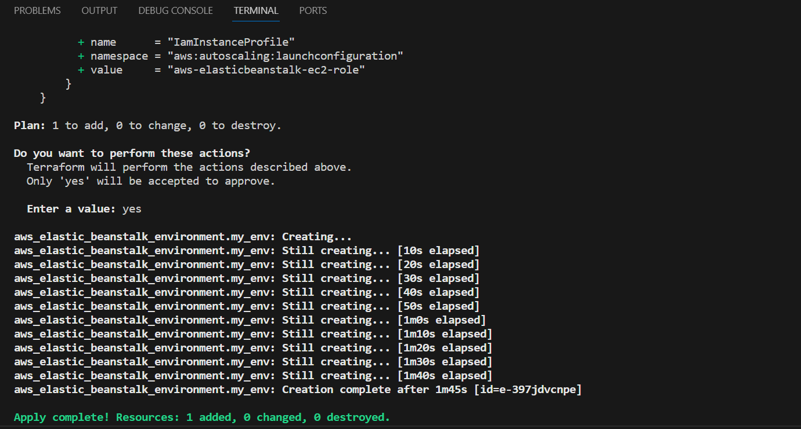
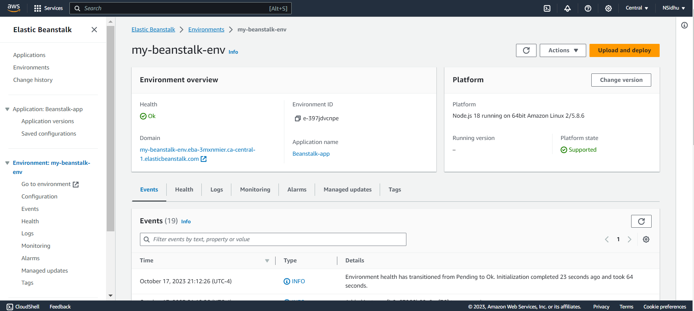
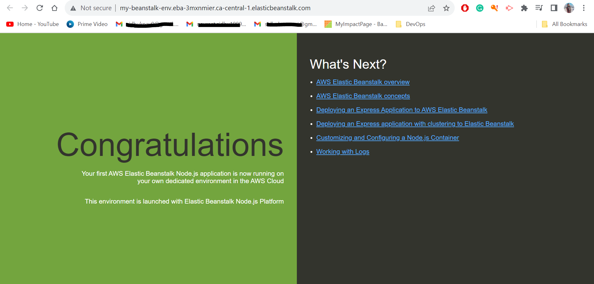

# Beanstalk

This project sets up an Elastic Beanstalk application and environment in AWS, allowing you to deploy and manage your applications easily.

* Terminal output for creation of EBS application

* EBS Environments in AWS

* EBS domain output
