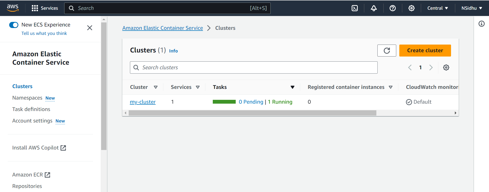
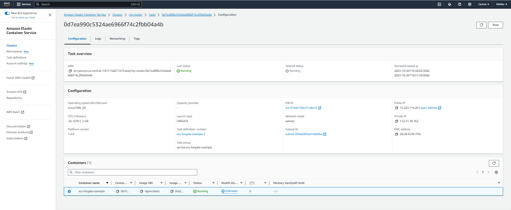

# Fargate

This project is used to set up an ECS Fargate service within a specified VPC and subnet, along with necessary security group configurations.

* Fargate Cluster created 

* Task of the Cluster showing nginx container
