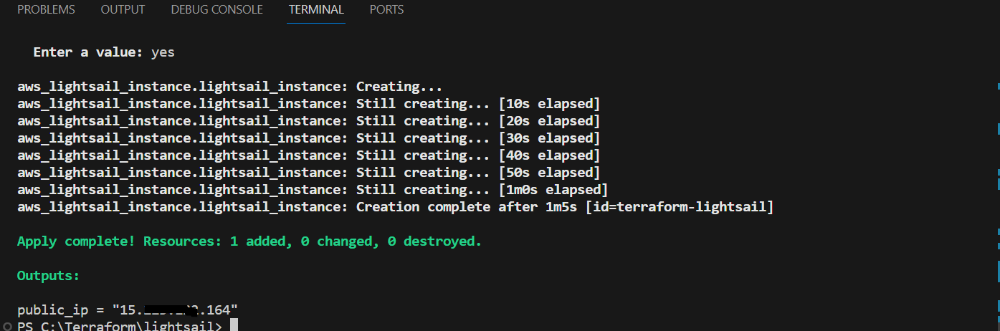
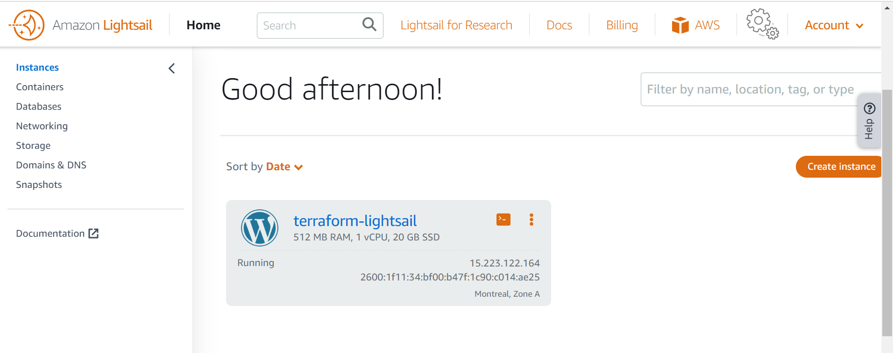

# Lightsail

This project sets up an AWS Lightsail instance with specified configurations and outputs the public IP address of the created instance. 

* Terminal output 

* Amazon lightsail created

* Lightsail output
